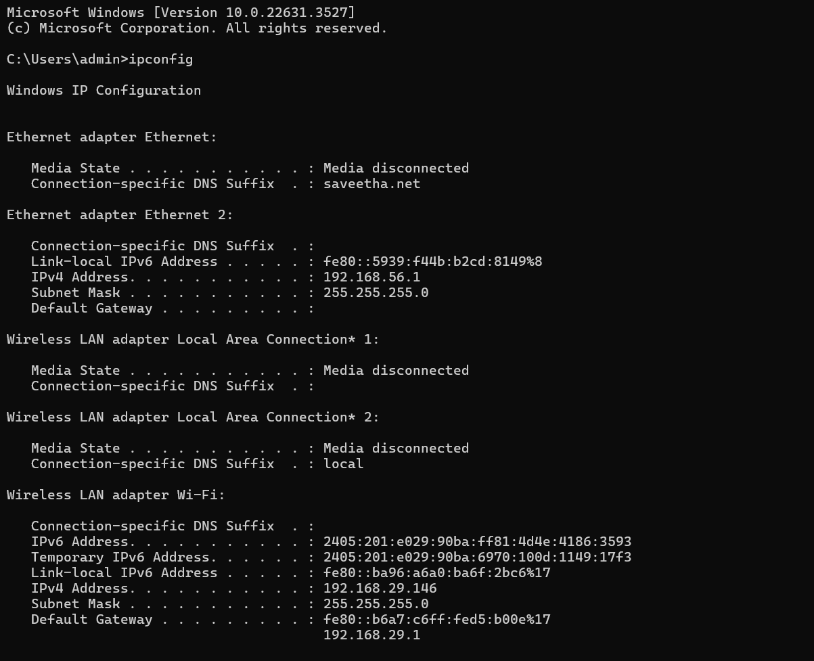
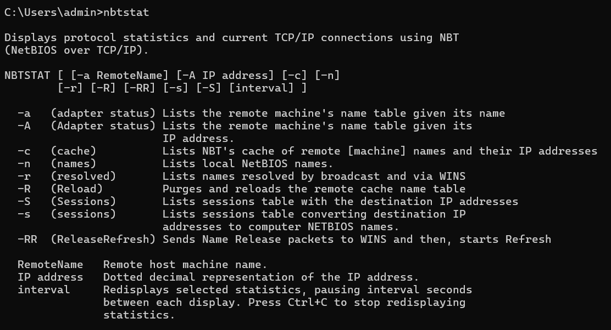
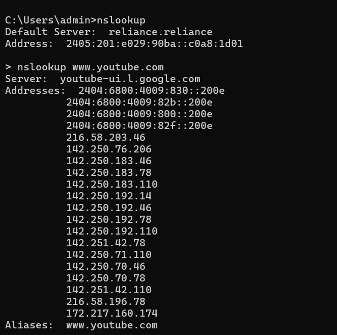
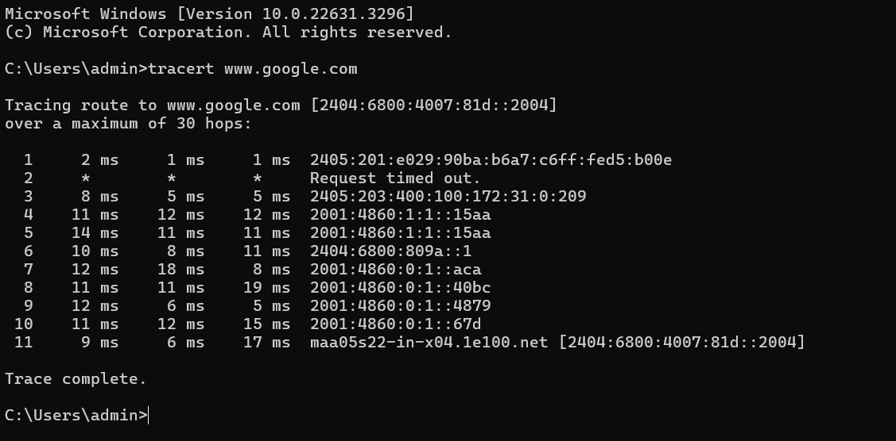
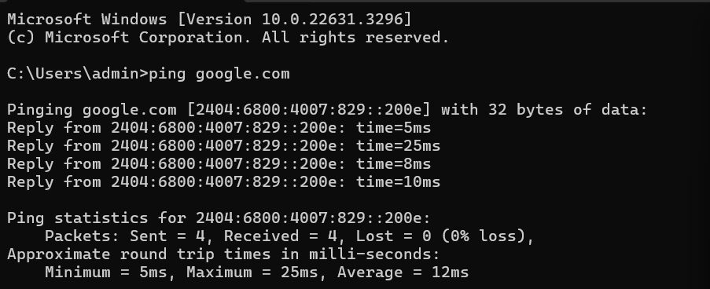

# EX.4 EXECUTION OF NETWORK COMMANDS
## AIM :
Use of Network commands in Real Time environment
## SOFTWARE : 
Command Prompt And Network Protocol Analyzer
## PROCEDURE: 
To do this EXPERIMENT- follows these steps:
<BR>
In this EXPERIMENT- students have to understand basic networking commands e.g cpdump, netstat, ifconfig, nslookup ,traceroute and also Capture ping and traceroute PDUs using a network protocol analyzer 
<BR>
All commands related to Network configuration which includes how to switch to privilege mode
<BR>
and normal mode and how to configure router interface and how to save this configuration to
<BR>
flash memory or permanent memory.
<BR>
This commands includes
<BR>
• Configuring the Router commands
<BR>
• General Commands to configure network
<BR>
• Privileged Mode commands of a router 
<BR>
• Router Processes & Statistics
<BR>
• IP Commands
<BR>
• Other IP Commands e.g. show ip route etc.
<BR>

```
Name : MUHAMMAD AFSHAN A
Reg No : 212223100035
```

## OUTPUT:
### IPCONFIG


### NBTSTAT


### NSLOOKUP


### HOSTNAME


### TRACERT


### PING


### NETSTAT


### GETMAC


## RESULT:
Thus Execution of Network commands Performed 
